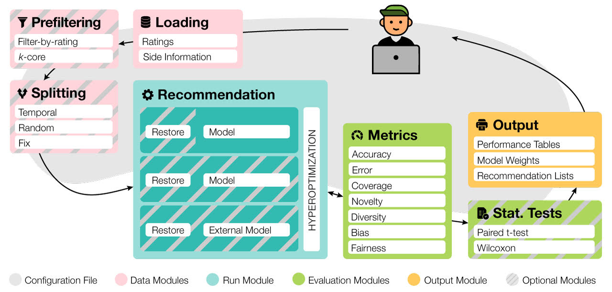

Introduction
======================

Elliot is a comprehensive recommendation framework that analyzes the
recommendation problem from the researcher's perspective. It conducts a
whole experiment, from dataset loading to results gathering. The core
idea is to feed the system with a simple and straightforward
configuration file that drives the framework through the experimental
setting choices. Elliot untangles the complexity of combining splitting
strategies, hyperparameter model optimization, model training, and the
generation of reports of the experimental results.

   system schema

The framework loads, filters, and splits the data considering a vast set
of strategies (splitting methods and filtering approaches, from temporal
training-test splitting to nested K-folds Cross-Validation). Elliot
optimizes hyperparameters for several recommendation algorithms, selects
the best models, compares them with the baselines providing intra-model
statistics, computes metrics spanning from accuracy to beyond-accuracy,
bias, and fairness, and conducts statistical analysis (Wilcoxon and
Paired t-test).

Elliot aims to keep the entire experiment reproducible and put the user
in control of the framework.

For all the details about Elliot, please refer to the `paper <https://arxiv.org/abs/2103.02590>`_ and cite [Elliot]_

.. [Elliot]
    Vito Walter Anelli and Alejandro Bellogín and Antonio Ferrara and Daniele Malitesta and Felice Antonio Merra and Claudio Pomo and Francesco Maria Donini and Tommaso Di Noia. 2021.
    Elliot: a Comprehensive and Rigorous Framework for Reproducible Recommender Systems Evaluation.
    *Under review*.
    arXiv:`2103.02590 <https://arxiv.org/abs/2103.02590>`_ [cs.IR].